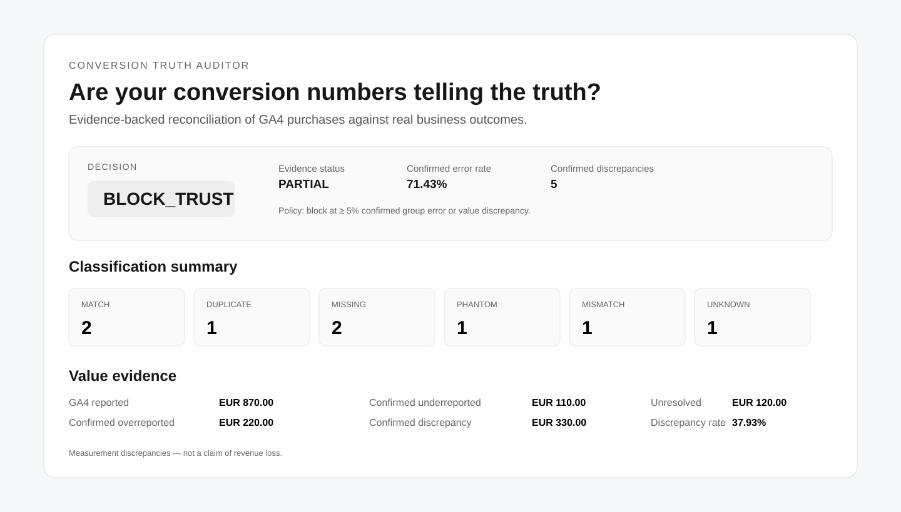

# Conversion Truth Auditor

**Are your conversion numbers telling the truth?**

Your ad platform can report a conversion. GA4 can report a purchase. Neither proves the business outcome actually happened once, with the right value.

Conversion Truth Auditor compares **GA4 purchase events against real paid orders** and returns evidence-backed findings plus a trust decision:

`PASS` · `WARN` · `BLOCK_TRUST` · `UNKNOWN`



## Why this exists

Matching totals can still hide broken tracking.

A dataset can report 100 purchases in GA4 and 100 paid orders while still containing missing purchases, duplicates, phantom transactions, or wrong values that cancel each other out at the aggregate level.

Conversion Truth Auditor reconciles transactions one by one before telling you whether the dataset is safe to trust.

## 60-second quickstart

Requires Python 3.11+. The v0.2 core has no runtime dependencies.

```bash
git clone https://github.com/achirothmane/conversion-truth-auditor.git
cd conversion-truth-auditor

PYTHONPATH=src python -m conversion_truth.cli \
  --truth tests/fixtures/truth.csv \
  --ga4 tests/fixtures/ga4.csv \
  --json report.json \
  --html report.html
```

The included fixture is intentionally broken. Expected result:

```text
Decision: BLOCK_TRUST
Evidence: PARTIAL

MATCH       2
DUPLICATE   1
MISSING     2
PHANTOM     1
MISMATCH    1
UNKNOWN     1
```

Open `report.html` to inspect the evidence behind the decision.

## What it catches

| Finding | Meaning |
|---|---|
| `MATCH` | Paid order and GA4 purchase reconcile |
| `DUPLICATE` | One real transaction produced multiple GA4 purchases |
| `MISSING` | A paid order has no corresponding GA4 purchase |
| `PHANTOM` | GA4 reports a keyed transaction with no matching paid order |
| `MISMATCH` | The transaction exists on both sides but values disagree |
| `UNKNOWN` | Evidence is insufficient for a safe classification |

`UNKNOWN` is intentional. Missing evidence does not become a confident accusation.

## Example: why trust gets blocked

For the included fixture:

```text
GA4 reported value             EUR 870.00
Confirmed overreported value   EUR 220.00
Confirmed underreported value  EUR 110.00
Confirmed discrepancy          EUR 330.00
Unresolved                     EUR 120.00
```

These are **measurement discrepancies, not claimed revenue loss**.

The default materiality policy blocks trust when either the confirmed group error rate or confirmed discrepancy value rate reaches 5%. The policy is explicit rather than hidden inside the tool.

## Evidence before action

Every decision must answer:

- What failed?
- Which transactions prove it?
- How much reported value is affected?
- How strong is the evidence?

Example:

```text
ORD-1002
Classification: DUPLICATE
Confidence: HIGH

Truth: EUR 80.00 × 1
GA4:   EUR 80.00 × 2
Reason: MULTIPLE_GA4_PURCHASES_FOR_ONE_TRUTH_TRANSACTION
```

An unkeyed GA4 event is instead reported as:

```text
G-007
Classification: UNKNOWN
Confidence: LOW
Reason: NO_TRANSACTION_ID
```

## Input format

### `truth.csv`

```csv
transaction_id,event_type,timestamp,value,currency,status
ORD-1001,purchase,2026-09-24T10:00:00Z,100.00,EUR,paid
```

### `ga4.csv`

```csv
event_id,transaction_id,event_type,timestamp,value,currency
G-001,ORD-1001,purchase,2026-09-24T10:00:03Z,100.00,EUR
```

The current core deliberately prefers exact transaction evidence over fuzzy matching.

## Scope of v0.2

v0.2 performs transaction-level reconciliation between real business outcomes and GA4 purchase events.

Google Ads event-level reconciliation is **not** claimed in this version. Standard Google Ads reporting does not expose the transaction identifiers required to prove the same one-to-one mapping from ordinary reports. A later Ads layer should reconcile only at the level supported by available evidence unless stronger source logs are provided.

## Outputs

- `report.json` — machine-readable findings and decision
- `report.html` — standalone human-readable evidence report

The core pipeline is:

```text
truth.csv + ga4.csv
        ↓
   normalization
        ↓
 transaction matching
        ↓
  classification
        ↓
     evidence
        ↓
 decision policy
        ↓
 JSON + HTML report
```

## Run the tests

```bash
PYTHONPATH=src python -m unittest discover -s tests -p 'test_unittest.py' -v
```

The golden fixture verifies the expected classifications, evidence behavior, decision policy, and report output.

## Current status

**v0.2 — working evidence-gated core.**

Next product questions are deliberately about adoption before architecture: can real operators provide the two exports easily, does the report reveal issues they care about, and is repeated monitoring valuable enough to justify a paid workflow?
